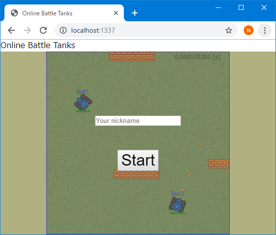
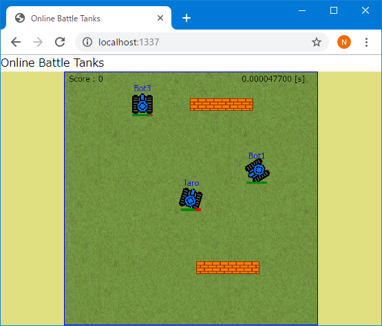

# OnlineBattleTanksWebGL
オンライン対戦ゲームを作る ( Node.js + Socket.io + WebGL )

オンライン対戦ゲームを作る ( Node.js + Socket.io )  
https://www.hiramine.com/programming/onlinebattletanks_nodejs_socketio/index.html  
の描画処理は、HTML5のCanvas関数を利用しています。  
このプログラムは、描画処理に、HTML5のCanvas関数を利用する代わりに、WebGLを利用する実装サンプルです。

画像ファイルの描画は、WebGLのテクスチャ描画処理を利用しています。 
文字については、HTML5のCanvas関数を利用しています。

## Screenshots : スクリーンショット
  

## Requirements : 必要条件、依存関係
- Node.js v10.16.3

## Author : 作者
Nobuki HIRAMINE : [http://www.hiramine.com](http://www.hiramine.com)

## License : ライセンス
```
Copyright 2019 Nobuki HIRAMINE

Licensed under the Apache License, Version 2.0 (the "License");
you may not use this file except in compliance with the License.
You may obtain a copy of the License at

    http://www.apache.org/licenses/LICENSE-2.0

Unless required by applicable law or agreed to in writing, software
distributed under the License is distributed on an "AS IS" BASIS,
WITHOUT WARRANTIES OR CONDITIONS OF ANY KIND, either express or implied.
See the License for the specific language governing permissions and
limitations under the License.
```
